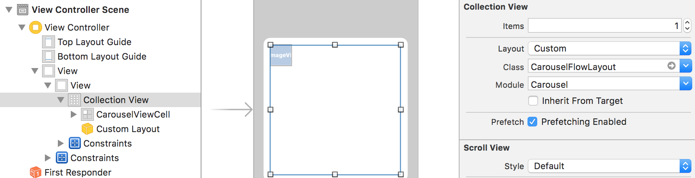
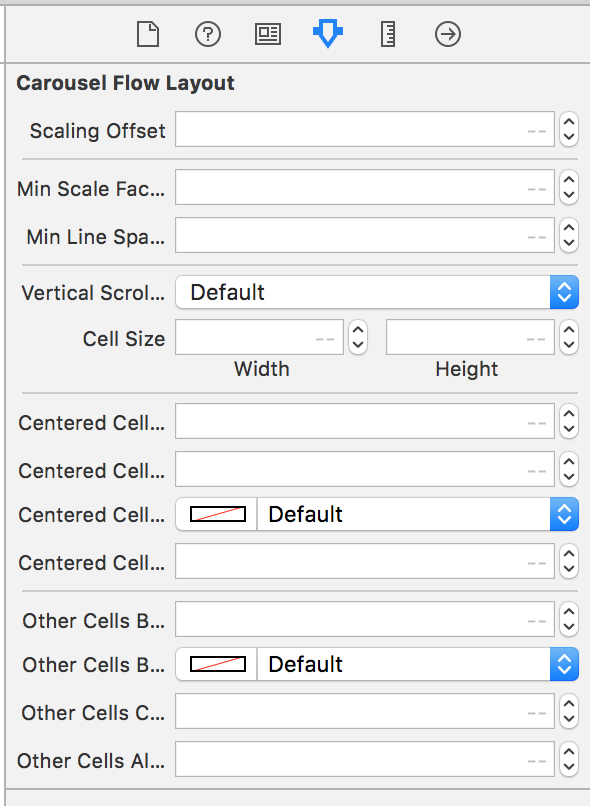

# **General Information**

"Carousel".  
Using **Swift** language. 

This is a framework which include custom flow for collection view. 


# **Getting Started**

First of all, you need import this framework to your project.

For using CustomFlowLayout class you need:
```Swift
    import Carousel
```
###### **Carthage**

To integrate Carousel-widget into your Xcode project using Carthage, specify it in your Cartfile:
```Swift
    git "https://git.urancompany.com/portfolio/carousel-widget.git" ~> 1.0
```
Run carthage update to build the framework and drag the built Carousel.framework into your Xcode project. 

To setup default carousel views, init CarouselTheme:
```Swift
   сarouselFlowLayout.carouselTheme = CarouselTheme()
```
CarouselTheme conform CarouselAppearence protocol:
```Swift
    protocol CarouselAppearence{
    
        /// Minimum scale allowed for cell
        var minScaleFactor: CGFloat { get set }
    
        /// Distance from center when attributes start applying for center cell.
        /// If offsets >= scalingOffset scale factor will be minimumScaleFactor
        var scalingOffset: CGFloat { get set }
    
        /// Minimum line spacing
        var minLineSpacing: CGFloat { get set }
    
        /// Scroll direction
        var verticalScrollDirection: Bool { get set }
    
        /// Settings for item size (for scale = 1)
        var cellSize: CGSize { get set }
  
        /// Settings for centered cell: corner radius
        var centeredCellCornerRadius: CGFloat { get set }
    
        /// Settings for centered cell: border width
        var centeredCellBorderWidth: CGFloat { get set }
    
        /// Settings for centered cell:border color
        var centeredCellBorderColor: UIColor { get set }
    
    
        /// The transparency of the centered cell
        var centeredCellAlpha: CGFloat { get set }
    
        /// Settings for other cells: corner radius
        var otherCellsCornerRadius: CGFloat { get set }
    
        /// Settings for other cells: border width
        var otherCellsBorderWidth: CGFloat { get set }
    
        /// Settings for other cells: border color
        var otherCellsBorderColor: UIColor { get set }
    
        /// The transparency of the other cells
        var otherCellsAlpha: CGFloat { get set }
   
    }
```


## **Example**

Carousel-Demo target demonstrate Carousel framework.

- Init carousel layout.
```Swift
    var carouselLayout = CarouselFlowLayout()
```

- Init collection view.
```Swift
    var collectionView = CarouselCollectionView.init(frame: .zero, collectionViewLayout: self.carouselLayout) 
```

- For default setting view, add CarouselTheme.
```Swift
    carouselLayout.carouselTheme = CarouselTheme()
```

- Or you can do all setting in IB.
    - Add collection view and CarouselFlowLayout.
    
    

    - View Settings.
    
    

##### **Build Requirements**
 
Xcode 8.0 (iOS 9.1) or later
 
##### **Runtime Requirements**
 
iOS 9.1 or later

